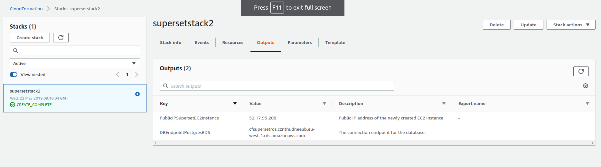

## Data Vizualization with Apache Supset Workshop - 25 May

## Installation on Ubuntu


#### Dependencies
``` bash
sudo apt update -qq
sudo apt install -y python3 python3-pip
sudo apt-get install -y  -qq build-essential libssl-dev libffi-dev libsasl2-dev libldap2-dev
sudo pip3 install pandas==0.23.4 SQLAlchemy==1.2.2 psycopg2-binary pymssql superset 
sudo chmod  777 /usr/local/lib/python3.5/dist-packages/superset
```

#### Setup
``` bash
export FLASK_APP=superset
flask fab create-admin  --username admin123 --password admin1234 --firstname admin --lastname admin --email admin@gma.com
superset db upgrade 
superset init
```

#### Start Superset

``` bash
superset runserver -p 8080
```
https://0.0.0.0:8080

Login ID : admin123

Password : admin1234

## Installation on EC2 instance

**Note** : You will need an AWS account for running this on EC2. Familiarity with KeyPair, EC2 and RDS is assumed.

### Step 1: Create AWS account and KeyPair
Create the Keypair as **first_ec2_instance**

### Step 2: Run cloudformation script
```bash
aws cloudformation create-stack --template-body file://superset_cloud_formation.yaml  --stack-name supersetstack2  --parameters ParameterKey=KeyPairName,ParameterValue=first_ec2_instance
```

### Step 3: After the stack is created, check the outputs tab on the AWS cloudformation console for the EC2 IP address and DB endpoint as show in the picture below


### Step 4: Login into the EC2 instance via SSH and create a file called **superset_config.py** and insert the following code and replace the DBendpoint which you found from the Outputs Tab in the prevous step

```python3
import os

SQLALCHEMY_DATABASE_URI = 'postgresql://admin123:admin1234567890@<replace your DB END point here>:5432/postgres'
```

### Step 5: Run the following commands in the EC2 instance

This install dependencies as showin in the previous section with just 1 new line export SUPERSET_CONFIG_PATH=/home/ubuntu/superset_config.py


```bash
wget 
sudo apt update -qq
sudo apt install -y python3 python3-pip
sudo apt-get install -y  -qq build-essential libssl-dev libffi-dev libsasl2-dev libldap2-dev
sudo pip3 install pandas==0.23.4 SQLAlchemy==1.2.2 psycopg2-binary pymssql superset 
sudo chmod  777 /usr/local/lib/python3.6/dist-packages/superset
export SUPERSET_CONFIG_PATH=/home/ubuntu/superset_config.py
export FLASK_APP=superset
flask fab create-admin  --username admin123 --password admin1234 --firstname admin --lastname admin --email admin@gma.com
superset db upgrade 
superset load_examples
superset init
nohup superset runserver -p 8080 > /dev/null &
```

### Step 6: Go to Chrome and go to port 8080 of your EC2 ip addreess

This public IP is from your
```
<my ec2 public ip>:8080
```
Login ID: admin123

Password : admin1234


